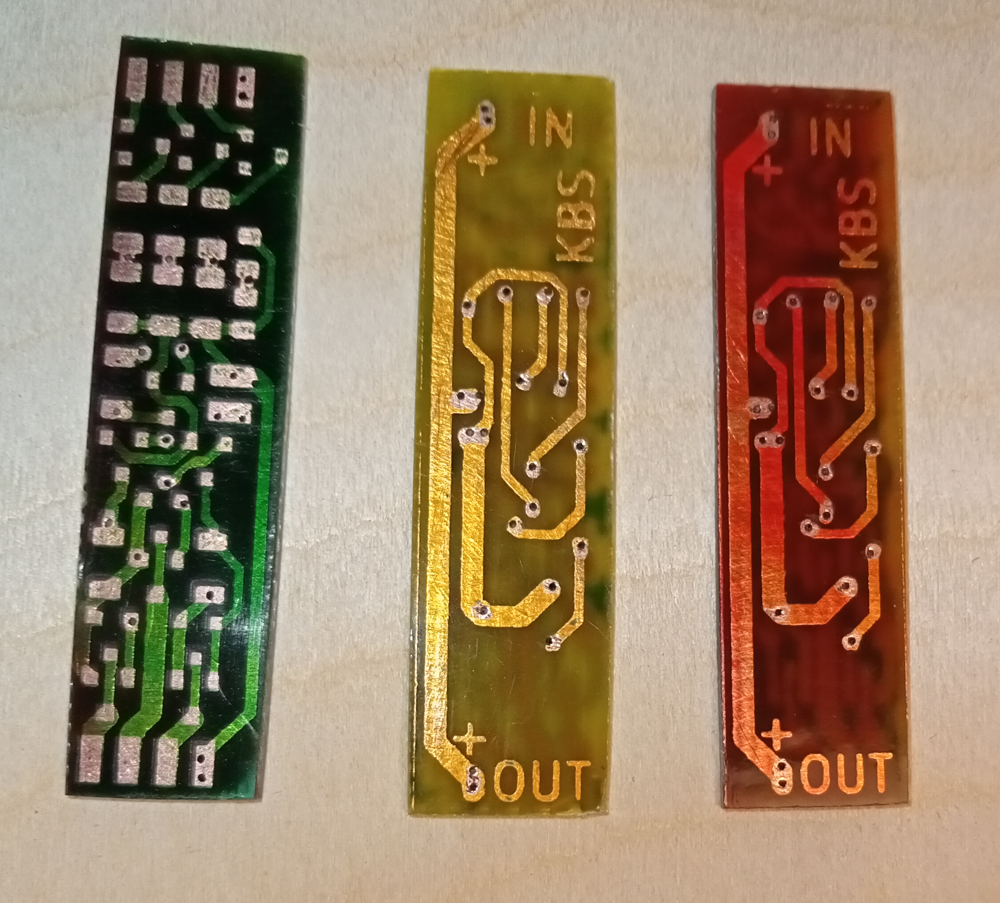
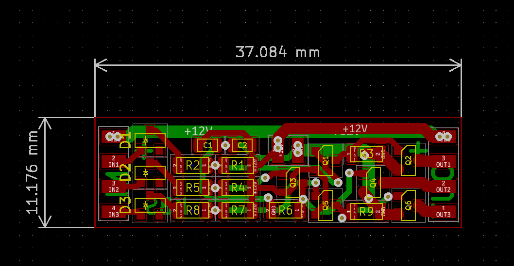

# RGB-Strip-AMP

12V RGB LED strip amplifier is used to reduce the voltage drop in long LED strips.

### Output
3x1.5A, 2.5-5m 5050 LED.

Amplifier needs an external 12V and GND supply lines.
All LED strips connected in one circuit should be powered by the same power supply. (Input 12V and Output 12V rails are connected.)

See wiring diagram. https://github.com/kbs3056/RGB-Strip-AMP/blob/main/wiring_diagram.pdf

